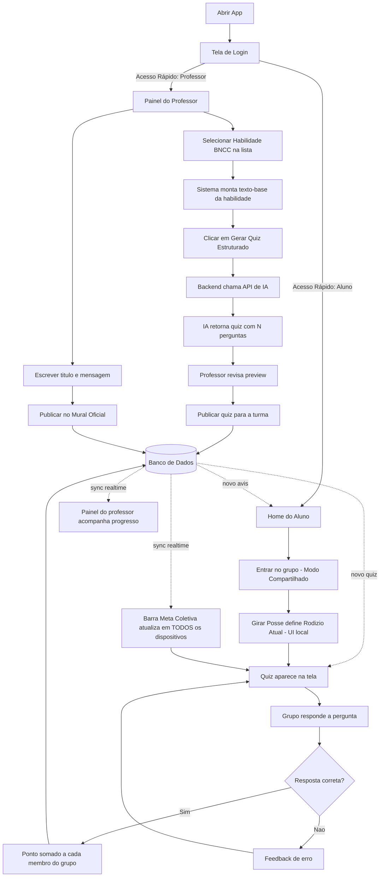

# Requisitos e Fluxo — Kodic Edu (Versão Final, Escopo de 48h)

**Atualizado em:** 2026-09-12
**Substitui a versão anterior**, agora reconciliada com o design real mapeado em [`paginas-draft/MAPEAMENTO.md`](./paginas-draft/MAPEAMENTO.md). Cada requisito abaixo já vem com a decisão de implementação:

- 🟢 **REAL** — implementar de verdade (lógica/dado dinâmico).
- 🟡 **MOCK** — aparece na tela, mas é dado fixo/estático, sem lógica por trás.
- ⚪ **FORA DO ESCOPO** — não entra nem visualmente na demo.

A regra geral: só é **REAL** o que sustenta o "uau" central da demo (professor gera quiz → alunos respondem em grupo → barra sobe em tempo real). Tudo que é rico visualmente mas caro de implementar vira **MOCK** com dado fixo — mesma estratégia já definida no [`PLANO.md`](./PLANO.md).

## Requisitos Funcionais

### A. Acesso

| ID | Requisito | Status |
|----|-----------|--------|
| RF-01 | Tela de login com toggle "Sou Aluno / Sou Professor" e campos de e-mail/senha — os campos existem visualmente mas não validam nada. | 🟡 MOCK |
| RF-02 | Botões de "Acesso Rápido de Demonstração" logam instantaneamente como usuário fixo: aluno (Alex Silva) ou professora (Cláudia Mendes). Este é o caminho real de entrada usado na demo. | 🟢 REAL |

### B. Professor — Geração de Quiz com IA

| ID | Requisito | Status |
|----|-----------|--------|
| RF-03 | O professor seleciona uma Habilidade BNCC de uma lista pré-cadastrada (array estático no front, sem chamada real à API bncc.dev). | 🟢 REAL |
| RF-04 | Ao selecionar a habilidade, o sistema usa a descrição textual associada a ela (hardcoded) como prompt/contexto e envia para a API de IA (Gemini/OpenAI) — **mesmo mecanismo de "texto → IA" do escopo original, só que o texto vem de uma lista fixa em vez do professor digitar.** | 🟢 REAL |
| RF-05 | A IA retorna um quiz estruturado com N perguntas de múltipla escolha (sugestão: 3 perguntas, 4 alternativas, 1 correta). | 🟢 REAL |
| RF-06 | O professor visualiza um preview do quiz gerado antes de publicar. | 🟢 REAL |
| RF-07 | O professor publica o quiz para a turma com uma ação ("Gerar Quiz Estruturado"). | 🟢 REAL |
| RF-08 | Selo "Zero Alucinação" / texto reforçando que o quiz foi ancorado na BNCC oficial. | 🟡 MOCK |

> **Decisão sobre texto livre vs. dropdown:** ficou o dropdown de habilidade BNCC. O esforço de implementação é o mesmo do texto livre (é só trocar a origem da string enviada à IA), mas o pitch fica muito mais forte ("ancorado nas 1.721 habilidades da BNCC, zero alucinação") e o resultado da demo fica previsível (sem depender de o professor digitar algo coerente na hora).

### C. Professor — Quadro de Avisos

| ID | Requisito | Status |
|----|-----------|--------|
| RF-09 | O professor preenche título + mensagem e publica um comunicado oficial para a turma. | 🟢 REAL |
| RF-10 | O comunicado publicado aparece no card de avisos da Home do aluno. | 🟢 REAL |

### D. Aluno — Modo Compartilhado (Grupo)

| ID | Requisito | Status |
|----|-----------|--------|
| RF-11 | Um dispositivo representa um grupo de 2 a 4 alunos (Modo Compartilhado). | 🟢 REAL |
| RF-12 | Cada membro do grupo tem pontuação individual, sincronizada em tempo real junto com a do grupo ("Sincronização Justa de Pontos"). | 🟢 REAL |
| RF-13 | Botão "Girar Posse" alterna visualmente qual membro é o "Rodízio Atual" — indicativo apenas, não bloqueia interação de ninguém. | 🟡 MOCK (UI local, sem permissão real) |
| RF-14 | Ao acertar uma questão, todos os membros do grupo recebem o ponto simultaneamente (incremento igual para todos). | 🟢 REAL |

### E. Aluno — Quiz e Progresso

| ID | Requisito | Status |
|----|-----------|--------|
| RF-15 | O aluno visualiza e responde ao quiz publicado pelo professor. | 🟢 REAL |
| RF-16 | Feedback imediato (certo/errado) após cada resposta. | 🟢 REAL |
| RF-17 | Barra "Meta Coletiva da Turma" atualiza em tempo real conforme qualquer grupo acerta questões (Supabase Realtime/Firebase). | 🟢 REAL |
| RF-18 | Texto de "Recompensa Coletiva" (ex: "Passeio Cultural Virtual") exibido junto da meta — sem lógica de resgate real. | 🟡 MOCK |

### F. Conteúdo Colaborativo

| ID | Requisito | Status |
|----|-----------|--------|
| RF-19 | Membros do grupo podem adicionar um item ao repositório do grupo: upload de foto (caderno) ou link, com tag do tipo ("Print de Caderno" / "Link Recomendado"). Lista simples, sem pastas automáticas. | 🟢 REAL (simplificado) |
| RF-20 | Tela "Trilhas de Aprendizagem (Missões)" com cards pré-configurados (nome, etapas, % de progresso, tag de tipo) — sem lógica real de progressão passo a passo. | 🟡 MOCK |

### G. Perfil, Papéis e Bem-estar

| ID | Requisito | Status |
|----|-----------|--------|
| RF-21 | Perfil exibe papel fixo do aluno (Curador/Revisor/Comunicador) e badges estáticas (Líder de Turma, Mentor Ouro / Mentor BNCC, Docente Inovador para o professor) — hardcoded no usuário demo. | 🟢 REAL (dado fixo, UI real) |
| RF-22 | "Modo Foco (Pomodoro 25m)": timer real client-side de contagem regressiva. Sem integração real com notificações do sistema operacional. | 🟢 REAL (simples) |
| RF-23 | Texto fixo de "Privacy by Design & LGPD" no menu lateral. | 🟡 MOCK |
| RF-24 | Aba "Impacto Silencioso": lista de notificações privadas — pode disparar 1 notificação real de exemplo quando o próprio usuário demo responde certo; o restante do feed é pré-cadastrado. | 🟡 MOCK (com 1 gatilho real) |

### H. Governança (visual apenas)

| ID | Requisito | Status |
|----|-----------|--------|
| RF-25 | Aba "Moderação" do professor sempre no estado vazio ("Nenhum item pendente... todos os materiais validados!"). | 🟡 MOCK |
| RF-26 | Aba "Heatmap" do professor exibe tabela estática de competências BNCC x % de domínio. | 🟡 MOCK |
| RF-27 | Card "Onboarding Progressivo do Docente" (Níveis 1/2/3) sempre com Nível 1 selecionado, sem lógica de progressão. | 🟡 MOCK |

### I. Sistema / Persistência

| ID | Requisito | Status |
|----|-----------|--------|
| RF-28 | Persistir turma, grupo, quiz ativo, pontuação (grupo e individual) e comunicados em banco de dados. | 🟢 REAL |
| RF-29 | Permitir múltiplos grupos simultâneos respondendo ao mesmo quiz, cada um somando ao total da turma. | 🟢 REAL |

### J. Visualização e Histórico de Quizzes

> Gap identificado: o design mostra o quiz "atual" embutido no card "Desafio Diário Coletivo" (Início) e como etapa dentro das Trilhas, mas não existe nenhuma tela pra ver quizzes **anteriores**, saber quais já foram respondidos ou conferir o resultado depois. Como RF-28 já exige persistir Quiz/Pergunta/Resposta, listar esse histórico de volta é praticamente gratuito — não precisa de tabela nova, só de uma tela/consulta a mais.

| ID | Requisito | Status |
|----|-----------|--------|
| RF-30 | Aba "Missões" do aluno ganha uma seção "Quizzes" (separada das Trilhas) listando os quizzes da turma: pendente (ainda não respondido pelo grupo) ou respondido (com o resultado, ex: "2/3 corretas"). | 🟢 REAL |
| RF-31 | Ao tocar num quiz já respondido, o aluno vê uma revisão simples: cada pergunta, a alternativa escolhida pelo grupo e a alternativa correta destacada. | 🟢 REAL |
| RF-32 | Professor vê, na aba "Assistente BNCC" ou "Visão Geral", a lista de quizzes que já publicou, com quantos grupos já responderam cada um. | 🟢 REAL |

**Onde entra na navegação:** dentro da aba **Missões** do aluno (ela já é o container de conteúdo pedagógico — Trilhas continuam mock, "Quizzes" vira uma seção real ao lado/acima). Do lado do professor, entra como uma lista simples na tela onde ele já gera quizzes (`Assistente BNCC`), abaixo do gerador.

**Como ver:** lista simples (cards ou linhas), sem paginação sofisticada — ordenar por mais recente primeiro. Tag de status ("Pendente" / "Respondido") como já é o padrão visual das outras tags do app.

### Fora do escopo (não implementar, nem mockar)

- ⚪ Toggle "Hub da Escola (Global)": aparece desabilitado / "em breve" na tela de Grupo — zero conteúdo por trás.
- ⚪ Cadastro de conta novo, recuperação de senha, autenticação real.
- ⚪ Hierarquia completa de turmas/matérias — só um grupo dentro de uma matéria.
- ⚪ Integração real com a API bncc.dev.

## Requisitos Não-Funcionais

| ID | Requisito |
|----|-----------|
| RNF-01 | Deve rodar em navegador mobile sem necessidade de instalação (web responsivo). |
| RNF-02 | Atualização da pontuação entre dispositivos deve ocorrer em até ~2s (tempo real perceptível na demo). |
| RNF-03 | Não deve exigir autenticação real — usuário fixo por sessão de demonstração (RF-02 é o caminho real de entrada). |
| RNF-04 | Interface deve seguir paleta em tons de roxo, com visual gamificado (conforme `PLANO.md`). |

## Tecnologias Indicadas

| Camada | Tecnologia | Por quê |
|---|---|---|
| **Front-end** | Next.js + Tailwind CSS (+ shadcn/ui pra acelerar componentes prontos: dialogs, dropdowns, cards) | Roda no navegador do celular sem instalar nada (RNF-01), rápido de estilizar no padrão roxo/gamificado, e o shadcn já entrega boa parte dos componentes usados nas telas (dropdown do Assistente BNCC, cards, badges). |
| **Hosting** | Vercel | Deploy em segundos, URL pública estável — importante pra abrir em 2 celulares reais na hora da demo sem depender de rede local. |
| **Backend + Banco + Tempo Real** | Supabase (Postgres + Realtime + Storage) | Um único serviço cobre banco relacional (modelo de dados abaixo), `Realtime` via `postgres_changes` pra sincronizar pontuação/barra entre dispositivos (RF-12, RF-14, RF-17) sem escrever WebSocket na mão, e `Storage` pra upload de foto de caderno (RF-19). |
| **Geração de Quiz (IA)** | Gemini API (`gemini-1.5-flash` ou similar) | Free tier generoso pra hackathon, latência baixa o suficiente pra gerar quiz em segundos ao vivo (RF-04/RF-05). OpenAI é alternativa equivalente se preferirem. |
| **Autenticação** | Nenhuma — apenas estado local (ex: `localStorage`/query param) guardando qual usuário fixo está "logado" naquele aparelho | RNF-03: sem login real; cada celular físico na demo só precisa saber "eu sou o Alex" ou "eu sou a Bia" pra entrar no grupo certo. |
| **Timer (Modo Foco)** | JS puro (`setInterval`) no client | RF-22 não precisa de lib — é só contagem regressiva local. |

## Fluxograma de Ações

## Modelo de Dados

Entidades necessárias para sustentar os requisitos **REAL** (RF marcados 🟢):

- **Turma**: id, nome
- **Grupo**: id, turma_id, nome/apelido, pontuação_total
- **Membro**: id, grupo_id, nome, papel (Curador/Revisor/Comunicador), pontos_individuais
- **Comunicado**: id, turma_id, titulo, mensagem, criado_em
- **Quiz**: id, turma_id, habilidade_bncc_id, texto_base, criado_em, status (ativo/encerrado)
- **Pergunta**: id, quiz_id, enunciado, alternativas (json), resposta_correta
- **Resposta**: id, grupo_id, pergunta_id, alternativa_escolhida, correta (bool), respondido_em
- **RepositorioItem**: id, grupo_id, tipo (foto/link), url, autor_membro_id, criado_em
- **HabilidadeBNCC** *(array estático, não precisa de tabela)*: código, competência, texto_base_para_ia

Essa modelagem cobre: geração/publicação do quiz (RF-03 a RF-07), quadro de avisos (RF-09, RF-10), modo compartilhado com pontuação individual (RF-11 a RF-14), resposta e sincronização (RF-15 a RF-18), repositório colaborativo (RF-19) e persistência (RF-28, RF-29) — sem tabela de usuário/autenticação real.

O histórico/visualização de quizzes (RF-30 a RF-32) **não precisa de entidade nova**: é uma consulta sobre `Quiz` + `Pergunta` + `Resposta` já existentes (`WHERE turma_id = X ORDER BY criado_em DESC`, com um `JOIN` em `Resposta` pra saber se aquele grupo já respondeu e qual foi o resultado).
